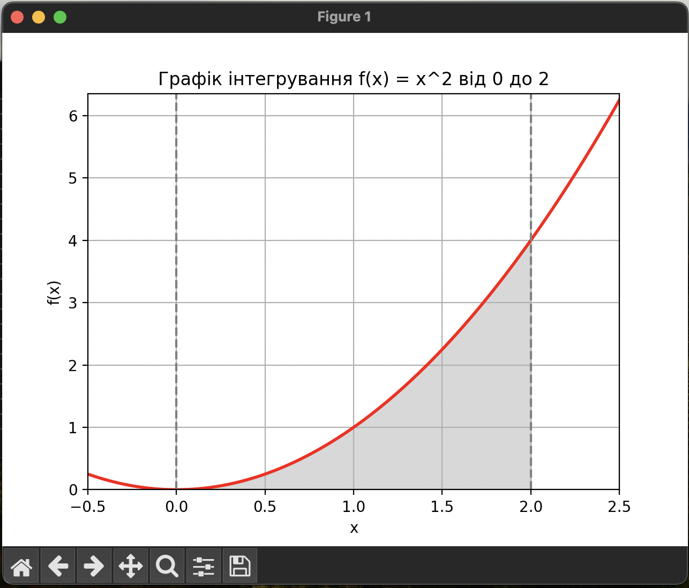

# goit-algo-hw-10

### goit-algo-hw-10

#### Висновки:
#### Завдання 1

- Status: Optimal
- 🍋 Лемонаду: 30.0
- 🍏 Фруктового соку: 20.0
- 🔄 Максимальна кількість продукту: 50.0

#### Завдання 2
|       Метод       |  Результат   |   Помилка    |
|-------------------|--------------|--------------|
|   Монте-Карло     | 2.6790178385 |              |
|       Quad        | 2.6666666667 | 2.9605947323e-14 |

**Графік функції**: На графіку функції `f(x) = x^2` видно, як вона змінюється на відрізку від 0 до 2. Під кривою зображена область, і ми цікавимося площею цієї області.

**Метод Монте-Карло** для обчислення інтегралу: Для апроксимації інтегралу функції від 0 до 2 ми використали метод Монте-Карло. Ми випадковим чином генерували точки і визначали, чи потрапляє кожна точка під криву. З цих даних ми розраховували оцінку інтегралу.

**Порівняння результатів**: Для перевірки точності результату ми використали вбудовану функцію quad, яка обчислює точне значення інтегралу. Це дозволило нам порівняти результат методу Монте-Карло з точним значенням, щоб оцінити ефективність методу.

